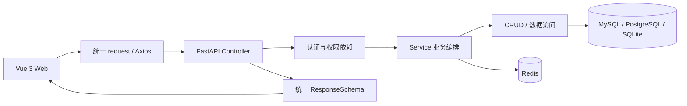

# CBWL_Adamin 项目工程指南

> 文档状态：基于 2026-08-12 仓库快照整理。运行事实以源码、锁文件和配置为准；架构、命令或交付流程变化时，应在同一 PR 中更新本文。

## 1. 文档目的

本文为开发者、评审者和编码 Agent 提供统一的项目地图与交付标准，解决三类问题：

1. 新成员能快速判断代码应放在哪里、如何启动和验证。
2. 前后端改动遵循同一份接口、测试、Git 和安全约束。
3. Agent 不因错误项目背景、过期 README 或局部代码模式而扩大范围、重复造轮子或破坏兼容性。

强制规则放在根目录及子目录的 `AGENTS.md`；本文负责解释项目结构和流程。外部规范依据见 [`references/engineering-standards-research.md`](references/engineering-standards-research.md)。

## 2. 项目定位

CBWL_Adamin 当前基于 FastApiAdmin 3.x 脚手架，是一个面向后台管理场景的前后端单仓库：

- 后端提供认证授权、用户/角色/菜单/部门、监控、任务、工作流、代码生成、文件与 AI 等 API。
- Web 前端提供 Vue 3 管理界面，并通过动态菜单/路由连接后端权限体系。
- Docker Compose 提供 MySQL、Redis、后端和 Nginx 的本地或部署编排。
- `frontend/app/` 和 `frontend/docs/` 目前只有占位文件，不能把 README 中的历史描述当作已实现能力。

### 技术基线

| 区域 | 已核实技术与版本约束 | 事实来源 |
| --- | --- | --- |
| 后端运行时 | Python >= 3.12 | `backend/.python-version`、`backend/pyproject.toml` |
| Web 运行时 | Node.js >= 20.19，pnpm 9.15.3 | `frontend/web/package.json` |
| 后端框架 | FastAPI、Pydantic v2、SQLAlchemy 2 async、Alembic | `backend/pyproject.toml`、`backend/app/` |
| 后端质量 | Ruff、pytest、pytest-asyncio | `backend/pyproject.toml`、`backend/tests/` |
| Web 框架 | Vue 3、TypeScript strict、Vite、Element Plus、Pinia、Axios | `frontend/web/package.json`、`tsconfig.json` |
| Web 质量 | ESLint、Prettier、Stylelint、Vitest、Vue Test Utils | `frontend/web/package.json`、相关配置 |
| 基础设施 | MySQL 8、Redis 7、Nginx、Docker Compose | `docker/docker-compose.yaml` |

版本号若与 README 表格不一致，以锁文件和包配置为准。

## 3. 仓库地图

```text
CBWL_Adamin/
├── AGENTS.md                       # 全仓不可违背的开发规则
├── docs/
│   ├── PROJECT_ENGINEERING_GUIDE.md # 本文：项目地图与交付流程
│   └── references/                 # 外部规范研究与依据
├── backend/
│   ├── AGENTS.md                   # FastAPI 后端细则
│   ├── app/
│   │   ├── api/v1/                 # 版本化业务 API
│   │   ├── common/                 # 公共响应、请求、枚举、常量
│   │   ├── config/                 # 设置与路径配置
│   │   ├── core/                   # 数据库、安全、中间件、路由等基础设施
│   │   ├── plugin/                 # 可发现插件及示例
│   │   ├── scripts/                # 初始化脚本
│   │   └── utils/                  # 稳定通用工具
│   ├── tests/                      # pytest 测试
│   ├── templates/                  # 代码生成模板
│   ├── env/                        # 环境配置模板/本地配置
│   ├── sql/                        # 初始化数据
│   ├── pyproject.toml              # Python 项目与质量工具配置
│   └── uv.lock                     # uv 锁文件
├── frontend/
│   ├── web/
│   │   ├── AGENTS.md               # Vue Web 细则
│   │   ├── src/api/                # API 封装和类型
│   │   ├── src/views/              # 业务页面
│   │   ├── src/components/         # 共享组件
│   │   ├── src/router/             # 路由、守卫、菜单处理
│   │   ├── src/store/              # Pinia 状态
│   │   ├── package.json            # 脚本与依赖
│   │   └── pnpm-lock.yaml          # pnpm 锁文件
│   ├── app/                        # 当前占位
│   └── docs/                       # 当前占位
├── docker/                         # Compose、Nginx、后端镜像配置
├── deploy.sh / deploy.bat          # 部署辅助脚本
└── README.md                       # 面向使用者的项目入口
```

## 4. 核心架构与调用链



后端按业务域纵向拆分，每个 feature 通常包含 `controller/service/crud/model/schema`。前端按相同业务域组织 `src/api/module_*` 与 `src/views/module_*`。新增全栈能力时，两侧的域名、资源名、权限码和接口语义应保持可追踪对应。

### 后端路由前缀

| 模块 | 前缀 | 主要职责 |
| --- | --- | --- |
| common | `/common` | 健康检查、文件等公共接口 |
| system | `/system` | 认证、用户、角色、菜单、部门、字典等 |
| monitor | `/monitor` | 服务、资源、缓存、在线用户 |
| task | `/task` | 定时任务、节点、工作流 |
| generator | `/generator` | 代码生成 |
| ai | `/ai` | AI 会话等能力 |

这些前缀由模块 `__init__.py` 和 `app/init_app.py` 聚合，新增接口应进入既有模块，避免平行入口。

## 5. 本地开发

### 5.1 前置依赖

- Python 3.12 与 uv
- Node.js 20.19+ 与 pnpm 9
- 业务联调时使用 MySQL 8 / PostgreSQL，Redis 6/7；后端测试使用隔离的 SQLite 和 mock Redis
- 可选：Docker 与 Docker Compose

### 5.2 后端

```powershell
Set-Location backend
Copy-Item env/.env.example env/.env.dev
uv sync --frozen
uv run python main.py run --env=dev
```

真实变量名和默认端口以 `backend/env/.env.example` 与设置代码为准。首次启动可能初始化数据，因此不要指向已有生产库或含重要数据的数据库。

### 5.3 Web 前端

```powershell
Set-Location frontend/web
Copy-Item .env.development.example .env.development
pnpm install --frozen-lockfile
pnpm run dev
```

项目只使用 pnpm。不要运行 `npm install`，也不要更新历史 `package-lock.json`。

### 5.4 Docker

```powershell
Set-Location docker
Copy-Item .env.example .env
docker compose --env-file .env config
docker compose --env-file .env up -d
```

先审查 `.env` 和挂载路径。当前 Compose 将宿主机 `backend/` 挂载进容器，更适合开发；正式部署前需单独评估并去除源代码覆盖挂载。

## 6. 新增功能的落点

### 6.1 新增后端业务资源

1. 在最接近的 `backend/app/api/v1/module_<domain>/` 下创建 feature。
2. 定义 ORM model 与输入/输出 schema，明确空值、枚举、分页和唯一性。
3. 在 CRUD 实现数据访问，在 service 实现业务规则与事务编排。
4. 在 controller 绑定路径、权限、依赖和统一响应。
5. 注册到模块路由或遵循现有插件发现机制。
6. 涉及表结构时提交可审查的 Alembic 迁移。
7. 添加 service/CRUD 与 API 测试，至少覆盖权限和失败路径。

### 6.2 新增 Web 页面

1. 在 `src/api/<domain>/` 定义 API 和 TypeScript 合约。
2. 在 `src/views/<domain>/` 实现页面，页面私有组件与页面相邻。
3. 复用 `@utils` 的 request、现有表单/表格/弹窗和权限能力。
4. 同步路由、后端菜单、权限码与缓存标识。
5. 添加关键交互测试，验证 loading、空状态、错误状态和重复提交。
6. 运行 lint、format check、stylelint、type-check、Vitest；路由/构建变化再执行 build。

### 6.3 跨端契约检查表

| 契约项 | 后端 | 前端 |
| --- | --- | --- |
| URL 与方法 | Router prefix + decorator | `API_PATH` + request method |
| 请求字段 | Pydantic schema / Query / Path | 表单与 query 类型 |
| 响应字段 | `ResponseSchema[T]` / 输出 schema | `ApiResponse<T>` |
| 分页 | `PaginationQueryParam` / `PageResultSchema` | `PageQuery` / `PageResult<T>` |
| 权限 | `AuthPermission([...])` | 菜单/按钮权限标识 |
| 文件 | media type / header / stream | Blob / FormData / 文件名处理 |

## 7. 质量门禁

### 7.1 非修改式检查

验证命令默认不应改写代码。项目现有 `ruff` 配置和前端 `pnpm run lint` 都可能自动修复，因此 CI/审查优先使用以下命令。

后端：

```powershell
Set-Location backend
uv sync --frozen
uv run ruff check --no-fix .
uv run ruff format --check .
uv run pytest -q
```

Web：

```powershell
Set-Location frontend/web
pnpm install --frozen-lockfile
pnpm exec eslint "src/**/*.{vue,ts,js}"
pnpm exec prettier --check "**/*.{js,cjs,ts,json,tsx,css,less,scss,vue,html,md}"
pnpm exec stylelint "**/*.{css,scss,vue}"
pnpm run type-check
pnpm run test
pnpm run build
```

仓库级：

```powershell
git diff --check
git status --short
```

### 7.2 风险分级

| 风险 | 典型变更 | 最低验证要求 |
| --- | --- | --- |
| 低 | 文档、无行为文案、局部样式 | 文件检查 + 相关 lint + diff review |
| 中 | 普通页面、API 业务逻辑、组件 | 静态检查 + 相关测试 + 类型检查 |
| 高 | 认证授权、数据库迁移、请求拦截器、路由守卫、上传下载、部署 | 全量相关测试 + 构建/迁移验证 + 安全与回滚评审 |

### 7.3 测试原则

- 测试必须能在错误实现上失败，并验证外部可观察结果。
- 单元测试覆盖纯业务规则；集成/API 测试覆盖数据库、权限和序列化边界；关键用户流程再补浏览器级验证。
- 缺陷修复必须有回归用例。测试不能依赖执行顺序、真实外部服务或生产数据。
- 覆盖率是发现盲区的信号，不用单一百分比替代关键风险测试。

## 8. Git 工作流

### 8.1 分支模型

推荐轻量 trunk-based 流程：

1. 从最新 `master` 创建短期分支。
2. 一个分支对应一个问题或可独立交付能力。
3. 通过 PR 评审和自动化检查后合并。
4. `master` 始终保持可构建、可回滚；紧急修复也通过 `hotfix/*` 和 PR 留痕。

分支示例：

```text
feature/123-user-import
bugfix/456-login-captcha-boundary
refactor/backend-crud-query
docs/engineering-guide
```

### 8.2 提交信息

格式：

```text
<type>(<scope>): <subject>

[optional body]

[optional footer]
```

原则：

- 标题表达结果，不写“update code”“fix bug”等无信息内容。
- 正文解释动机、约束和重要取舍，不逐行复述 diff。
- 使用 `Refs: #123` 关联任务；确实关闭问题时使用托管平台支持的关闭语法。
- 破坏性变更写作 `feat(api)!: ...`，并在 footer 提供 `BREAKING CHANGE:` 与迁移方式。
- 提交前用 `git diff --cached` 检查暂存内容，确保不含环境文件和他人改动。

### 8.3 PR 模板内容

每个 PR 至少回答：

```markdown
## 背景
为什么需要这次变更，关联什么问题？

## 变更
- 可评审的行为变化

## 验证
- [ ] 执行的命令及结果
- [ ] 手工验证路径（如适用）

## 风险与回滚
- API / 数据库 / 权限 / 配置 / 部署影响
- 回滚方式或不可逆说明

## 截图或合约示例
界面变化提供截图；接口变化提供请求/响应示例。
```

### 8.4 合并与发布

- 保护 `master`：禁止强推、要求 PR、至少一名评审者、要求必需状态检查通过。
- 小型聚焦 PR 可 squash 合并以保持主线清晰；需要保留独立语义的多提交变更可使用 merge，团队应固定一种默认策略。
- 不在已共享分支上随意 rebase/force push；必须改写时先通知协作者。
- 发布使用 `MAJOR.MINOR.PATCH`，Tag 与 CHANGELOG 对应；部署前明确数据库和配置回滚路径。

## 9. 配置与安全

- 仓库只提交 `.env*.example`，真实 `.env*` 由本地或部署平台管理。
- 示例值使用 `change-me`、`example.invalid` 等不可误用占位符，不能复制真实环境脱敏后仍可识别的数据。
- 前端构建产物中的变量对用户可见，任何密钥都只能保存在后端或秘密管理系统。
- 默认账号和演示密码只适用于本地/演示，部署前必须禁用或强制修改。
- 对依赖、镜像和锁文件进行自动化漏洞扫描；高危漏洞的升级应单独提交并验证兼容性。
- 权限、安全中间件、CORS、上传、OAuth、AI 外部调用和富文本处理属于高风险区域，修改时需要专门安全评审。

## 10. 当前基线差距

以下是本次盘点发现的事实或待确认项，不应在无关任务中顺手修改：

| 优先级 | 现状 | 风险/影响 | 建议动作 |
| --- | --- | --- | --- |
| P0 | GitHub Actions 文件位于 `frontend/web/.github/workflows/ci.yml` | GitHub 只从仓库根 `.github/workflows` 发现工作流，因此该 CI 很可能不会运行 | 单独任务将工作流迁到根目录，并加入后端与前端非修改式检查 |
| P0 | `CONTRIBUTING.md` 要求 PR 到 `dev`，现有工作流和当前远端分支却以 `master` 为主，远端未发现 `dev` | 贡献者无法判断真实合并目标，分支保护也难以统一 | 由项目负责人确认单主干或双长期分支；本文建议采用受保护 `master` + 短期分支，并同步贡献文档与 CI |
| P1 | 同时跟踪 `pnpm-lock.yaml` 与 `package-lock.json` | 开发者可能使用不同包管理器，产生不可复现依赖 | 统一 pnpm，评估后在独立 PR 删除 npm 锁文件 |
| P1 | Python 运行依赖同时维护在 `pyproject.toml`、`uv.lock` 和 `requirements.txt`，尚未声明生成/同步关系 | 三份清单可能漂移，开发、CI 和生产安装出不同依赖 | 明确 `pyproject.toml` 为声明源、`uv.lock` 为开发/CI 锁定结果，并由自动化导出或校验生产 requirements |
| P1 | `pnpm run lint` 和 Ruff 配置默认会修复文件 | CI 可能改写工作区后仍未报告格式漂移 | 提供独立 `lint:check`/`format:check` 脚本并在 CI 使用 |
| P1 | 后端尚无静态类型检查器门禁 | 跨层类型错误主要依赖运行时和测试发现 | 评估 Pyright 或 mypy，先小范围建立基线，避免一次性全仓降级规则 |
| P1 | 缺少根级 `.editorconfig` | 后端、Docker、Markdown 的编辑器行为不统一 | 在独立 PR 建立全仓 UTF-8/LF/缩进基线 |
| P2 | 部分 README 中的依赖版本与配置不一致 | 新成员可能按过期版本排障 | 以配置为源生成或定期核对技术栈表格 |
| P2 | 尚未见覆盖率、依赖扫描和秘密扫描门禁 | 质量与供应链风险缺少持续反馈 | CI 分阶段增加 coverage、dependency audit 和 secret scanning |

优先级表示治理价值，不代表本次文档任务已修复这些工程问题。

## 11. 文档维护责任

- 改变目录职责、启动命令、支持版本、路由前缀或质量门禁时，同步更新本文。
- 改变强制开发规则时，更新对应 `AGENTS.md`，并说明为什么规则变化。
- 面向最终用户的安装和功能变化更新 `README.md`；面向贡献者的流程变化更新 `CONTRIBUTING.md`。
- 决策有明显权衡或长期约束时，新增简短 ADR，而不是只把结论藏在聊天或提交信息中。
- 每季度或重大版本发布前复核“当前基线差距”，删除已解决项并记录新的事实。
